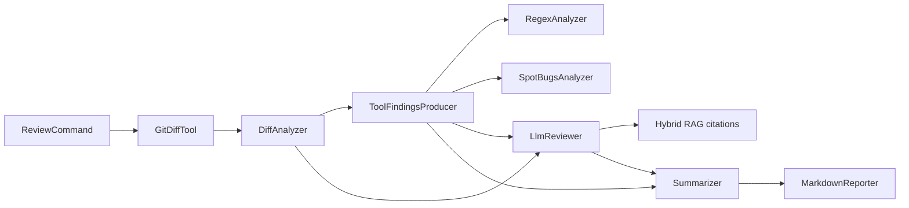
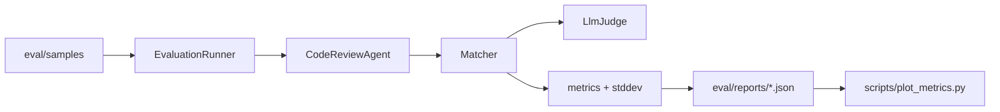

# Code Review Agent

Code Review Agent is a LangChain4j-based Java CLI that reviews git diffs with a deterministic pipeline: parse the diff, collect static findings and local context, ask one bounded LLM reviewer, then deduplicate and format structured findings with citations.

The current accepted release is **v3.1-tuned / w4-tuned**. W4 expanded evaluation to a 40-sample release suite, added repeated-run reporting, clarified tool status semantics, and improved recall, precision, and severity accuracy with deterministic severity calibration and high-confidence static finding backfill.

## Architecture

Runtime review path:



Evaluation loop:



More detail: [`docs/architecture.md`](docs/architecture.md).

## Quick Start

```bash
export MOONSHOT_API_KEY=<your-kimi-key>
mvn -q clean package -DskipTests
java -jar target/code-review-agent-1.0.0.jar review . HEAD~1
```

Run a smoke evaluation:

```bash
env -u DEBUG java -jar target/code-review-agent-1.0.0.jar eval \
  --version readme-smoke \
  --pipeline w3-pipeline \
  --suite smoke \
  --runs 1
```

Run the accepted release evaluation:

```bash
env -u DEBUG java -jar target/code-review-agent-1.0.0.jar eval \
  --version v3.1-tuned \
  --pipeline w4-tuned \
  --suite release \
  --runs 3
```

Sample format and isolation rules are in [`eval/samples/README.md`](eval/samples/README.md).

## Evaluation

The strict W4 release suite has 40 synthetic / reverse-style samples. Both accepted reports were run as 40 samples x 3 runs with no review errors.

| Version | Samples | Runs | Recall | Precision | FP rate | Severity acc. | Latency | Tool success |
| --- | --- | --- | --- | --- | --- | --- | --- | --- |
| v3 / w3-pipeline | 40 | 3 | 70.3% | 61.9% | 38.1% | 50.1% | 4.89s | 100.0% |
| v3.1-tuned / w4-tuned | 40 | 3 | 75.7% | 67.7% | 32.3% | 77.3% | 5.78s | 100.0% |

Historical v0/v1/v2 reports are preserved separately because strict 40-sample reruns hit review-error redlines on older code. They are useful context, but are not plotted against the 40-sample release number.

Generated report and chart: [`docs/eval-metrics.md`](docs/eval-metrics.md).

Honesty note: the evaluation set is hand-built, not a random real-PR benchmark. The numbers are good for regression checks and architecture comparisons inside this project, but they should not be treated as production accuracy on arbitrary repositories.

## Design Choices

- The main path is a deterministic pipeline rather than an autonomous AiServices tool loop. This makes inputs auditable and keeps `annotation.json`, `source-after/`, and metadata labels out of the agent-visible context.
- Static analyzers are advisory. `SKIPPED_EXPECTED` tool states are excluded from tool-success failures, while true analyzer exceptions are counted as `FAILED`.
- RAG citations are constrained to retrieved candidate IDs; the model is not allowed to invent citation IDs.
- Repeated evaluations record per-run metrics and standard deviation so release numbers are not a single lucky run.

## Demo

Use [`docs/demo-script.md`](docs/demo-script.md) for a reproducible build, review, smoke-eval, and report walkthrough.

## Roadmap

- Add real public PR samples and separate them from synthetic release fixtures.
- Expand high-confidence static rules only when they generalize beyond benchmark fixtures.
- Explore a later multi-reviewer `v4-stretch` only after the evaluation baseline is stable on real data.
