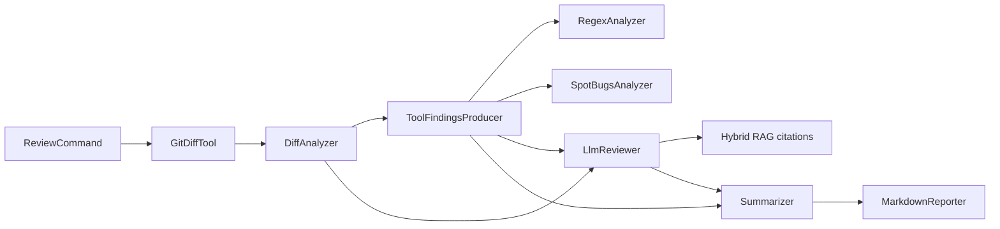
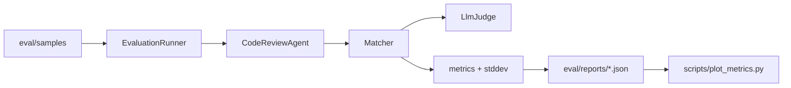

# Code Review Agent

Code Review Agent is a LangChain4j-based Java CLI that reviews git diffs with a deterministic pipeline: parse the diff, collect static findings and local context, ask one bounded LLM reviewer, then deduplicate and format structured findings with citations.

The current accepted release is **v3.1-tuned / w4-tuned**. W4 expanded evaluation to a 40-sample release suite, added repeated-run reporting, clarified tool status semantics, and improved recall, precision, and severity accuracy with deterministic severity calibration and high-confidence static finding backfill.

## Architecture

Runtime review path:



Evaluation loop:



More detail: [`docs/architecture.md`](docs/architecture.md).

## Quick Start

```bash
export APEMIND_API_KEY=<your-apemind-key>
mvn -q clean package -DskipTests
java -jar target/code-review-agent-1.0.0.jar review . HEAD~1
```

The default OpenAI-compatible endpoint is ApeMind and the default reviewer is
`gpt-5.6-sol`. Override `LANGCHAIN4J_OPEN_AI_CHAT_MODEL_BASE_URL` and
`LANGCHAIN4J_OPEN_AI_CHAT_MODEL_MODEL_NAME` to use another compatible deployment.
The legacy `MOONSHOT_API_KEY` setting remains supported.

Run a smoke evaluation:

```bash
env -u DEBUG java -jar target/code-review-agent-1.0.0.jar eval \
  --version readme-smoke \
  --pipeline w3-pipeline \
  --suite smoke \
  --runs 1
```

Run the accepted release evaluation:

```bash
env -u DEBUG java -jar target/code-review-agent-1.0.0.jar eval \
  --version v3.1-tuned \
  --pipeline w4-tuned \
  --suite release \
  --runs 3
```

Sample format and isolation rules are in [`eval/samples/README.md`](eval/samples/README.md).

## GitHub App server

The same jar can run as a self-hosted GitHub App. Register the App with these repository permissions:

- **Contents: read**
- **Pull requests: read and write**
- **Checks: read and write**
- **Metadata: read**

Subscribe to the `pull_request` event. The production intake URL is
`https://<your-host>/webhooks/github`; the supported actions are `opened`, `reopened`, and
`synchronize`.

The server requires PostgreSQL, a GitHub App ID, a PKCS#8 RSA private key, the webhook
secret, and the model API key. It fails startup when any required setting is absent or
invalid. GitHub's downloaded key can be converted to the expected form with:

```bash
openssl pkcs8 -topk8 -nocrypt \
  -in downloaded-github-app-key.pem \
  -out github-app-key-pkcs8.pem
```

For the Compose demo, copy the names-only template, set the non-key values in `.env`,
and pass the multi-line key through the process environment:

```bash
cp .env.example .env
# Edit .env. Use jdbc:postgresql://postgres:5432/code_review for the Compose database.
export GITHUB_APP_PRIVATE_KEY="$(<github-app-key-pkcs8.pem)"
docker compose up --build
```

For a jar deployment, export the same variables and run:

```bash
mvn -q clean package -DskipTests
java -jar target/code-review-agent-1.0.0.jar serve
```

Webhook processing is deliberately non-blocking: a valid signed delivery receives
HTTP `202` only after its delivery fact and review intent commit. A durable worker then
reviews the exact observed head SHA, rechecks that SHA immediately before publication,
and reconciles one Check Run plus eligible inline comments. Duplicate deliveries and
worker retries do not create duplicate runs or confirmed artifacts; a stale head produces
no new GitHub mutation.

Operational endpoints are:

- `/actuator/health` — process liveness only.
- `/actuator/health/readiness` — PostgreSQL reachability plus active webhook intake.
- `/actuator/metrics` — metric names and low-cardinality measurements, including lease recovery.

A GitHub or model outage leaves readiness up: affected durable jobs retry according to
their bounded backoff policy. The actuator surface never exposes environment values,
credentials, or health details.

GitHub HTTP calls also have bounded deadlines. `GITHUB_CONNECT_TIMEOUT` defaults to
`5s` and `GITHUB_READ_TIMEOUT` defaults to `30s`; both must be positive Spring duration
values. These deadlines turn a stalled GitHub request into a transient durable-job retry
without changing readiness.

### Signed local intake demonstration

The signature boundary can be exercised without a real GitHub credential. Start a
throwaway server with `GITHUB_WEBHOOK_SECRET=local-demo-only` (an ephemeral PKCS#8 key,
dummy App ID/model key, and local PostgreSQL are sufficient for startup), then run:

```bash
demo_body='{"action":"opened","installation":{"id":41},"repository":{"id":73,"full_name":"octo/demo","clone_url":"https://github.com/octo/demo.git"},"number":12,"pull_request":{"head":{"sha":"0123456789abcdef0123456789abcdef01234567"}}}'
demo_signature="$(printf '%s' "$demo_body" | openssl dgst -sha256 -hmac 'local-demo-only' -hex | sed 's/^.* //')"
curl -i http://localhost:8080/webhooks/github \
  -H 'Content-Type: application/json' \
  -H 'X-GitHub-Event: pull_request' \
  -H 'X-GitHub-Delivery: local-demo-1' \
  -H "X-Hub-Signature-256: sha256=$demo_signature" \
  --data "$demo_body"
```

The response is `202 Accepted`; this proves signed intake and durable admission only.
End-to-end publication requires an installed GitHub App and a valid model key.

## Evaluation

The strict W4 release suite has 40 synthetic / reverse-style samples. Both accepted reports were run as 40 samples x 3 runs with no review errors.

| Version | Samples | Runs | Recall | Precision | FP rate | Severity acc. | Latency | Tool success |
| --- | --- | --- | --- | --- | --- | --- | --- | --- |
| v3 / w3-pipeline | 40 | 3 | 70.3% | 61.9% | 38.1% | 50.1% | 4.89s | 100.0% |
| v3.1-tuned / w4-tuned | 40 | 3 | 75.7% | 67.7% | 32.3% | 77.3% | 5.78s | 100.0% |

Historical v0/v1/v2 reports are preserved separately because strict 40-sample reruns hit review-error redlines on older code. They are useful context, but are not plotted against the 40-sample release number.

Generated report and chart: [`docs/eval-metrics.md`](docs/eval-metrics.md).

Honesty note: the evaluation set is hand-built, not a random real-PR benchmark. The numbers are good for regression checks and architecture comparisons inside this project, but they should not be treated as production accuracy on arbitrary repositories.

## Design Choices

- The main path is a deterministic pipeline rather than an autonomous AiServices tool loop. This makes inputs auditable and keeps `annotation.json`, `source-after/`, and metadata labels out of the agent-visible context.
- Static analyzers are advisory. `SKIPPED_EXPECTED` tool states are excluded from tool-success failures, while true analyzer exceptions are counted as `FAILED`.
- RAG citations are constrained to retrieved candidate IDs; the model is not allowed to invent citation IDs.
- Repeated evaluations record per-run metrics and standard deviation so release numbers are not a single lucky run.

## Demo

Use [`docs/demo-script.md`](docs/demo-script.md) for a reproducible build, review, smoke-eval, and report walkthrough.

## Roadmap

- Add real public PR samples and separate them from synthetic release fixtures.
- Add scheduled review-comment feedback reconciliation as a dedicated follow-up.
- Expand high-confidence static rules only when they generalize beyond benchmark fixtures.
- Explore a later multi-reviewer `v4-stretch` only after the evaluation baseline is stable on real data.
