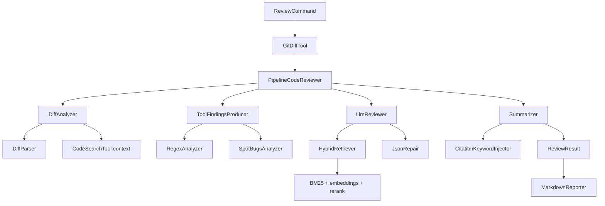
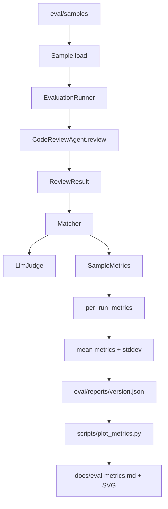

# Architecture

## Runtime Review Pipeline

The review command sends one explicit diff request through `PipelineCodeReviewer`. The pipeline exposes only the raw diff and `source-before/` context to the reviewer. Ground truth files used by eval are never part of the review prompt.

## Evaluation Loop

`EvaluationRunner` can repeat each sample with `--runs N`. For `N > 1`, report-level metrics are the mean of per-run aggregates, and `metrics_std_dev` captures run-to-run variance.

## Key Boundaries

| Boundary | Allowed | Forbidden |
| --- | --- | --- |
| Agent input | `diff.patch`, `source-before/` snippets | `annotation.json`, `source-after/`, `meta.category`, `meta.difficulty`, `meta.notes` |
| LLM output | JSON matching `ReviewResult` | Markdown fences, prose, invented citation IDs |
| Tool status | `RAN`, `SKIPPED_EXPECTED`, `FAILED` | Treating expected compile skips as analyzer failures |

## Why This Shape

The project started as a simpler LLM review agent, then moved toward deterministic orchestration as evaluation exposed false positives, hidden prompt inputs, and hard-to-debug tool behavior. The current shape keeps the creative part in one bounded reviewer call and leaves parsing, context gathering, tool accounting, deduplication, citation back-fill, and metrics to ordinary code.
