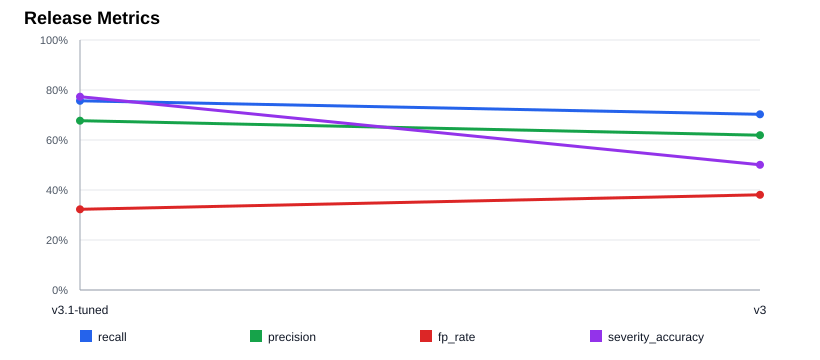

# Evaluation Metrics

Generated from `eval/reports/*.json` by `scripts/plot_metrics.py`.

Strict release charts include only reports with at least 40 samples. Historical reports are shown for context only and are not plotted.

## Strict release reports

| Version | Report | Samples | Runs | Suite | Pipeline | Recall | Precision | FP rate | Severity acc. | Latency | Tool success |
| --- | --- | --- | --- | --- | --- | --- | --- | --- | --- | --- | --- |
| v3.1-tuned | v3.1-tuned.json | 40 | 3 | release | w4-tuned | 75.7% | 67.7% | 32.3% | 77.3% | 5.78s | 100.0% |
| v3 | v3.json | 40 | 3 | release | w3-pipeline | 70.3% | 61.9% | 38.1% | 50.1% | 4.89s | 100.0% |

## Historical context

| Version | Report | Samples | Runs | Suite | Pipeline | Recall | Precision | FP rate | Severity acc. | Latency | Tool success |
| --- | --- | --- | --- | --- | --- | --- | --- | --- | --- | --- | --- |
| v0-baseline | v0-5sample-historical.json | 5 | 1 | - | w1-single-agent | 60.0% | 50.0% | 50.0% | 33.3% | 8.04s | 0.0% |
| v1-spotbugs-search | v1-20sample-historical.json | 20 | 1 | - | w1-single-agent | 50.0% | 31.2% | 68.8% | 30.0% | 34.62s | 0.0% |
| v2-rag-hybrid | v2-20sample-historical.json | 20 | 1 | dev | w2-hybrid-rerank | 65.0% | 37.1% | 62.9% | 46.2% | 8.35s | 70.0% |

## Legacy dev reports

| Version | Report | Samples | Runs | Suite | Pipeline | Recall | Precision | FP rate | Severity acc. | Latency | Tool success |
| --- | --- | --- | --- | --- | --- | --- | --- | --- | --- | --- | --- |
| v0-baseline | v0-baseline.json | 5 | 1 | - | w1-single-agent | 60.0% | 50.0% | 50.0% | 33.3% | 8.04s | 0.0% |
| v1-spotbugs-search | v1-spotbugs-search.json | 20 | 1 | - | w1-single-agent | 50.0% | 31.2% | 68.8% | 30.0% | 34.62s | 0.0% |
| v2-rag-hybrid | v2-rag-hybrid.json | 20 | 1 | dev | w2-hybrid-rerank | 65.0% | 37.1% | 62.9% | 46.2% | 8.35s | 70.0% |
| v3-pipeline | v3-pipeline.json | 20 | 1 | dev | w3-pipeline | 70.0% | 66.7% | 33.3% | 28.6% | 4.53s | 50.0% |

## W4 tuning note

`v3.1-tuned` is the accepted W4 result. Deterministic category-based severity calibration and high-confidence static finding backfill improved recall, precision, false-positive rate, and severity accuracy versus `v3`, while passing the no-review-error redline across 40 samples x 3 runs.
