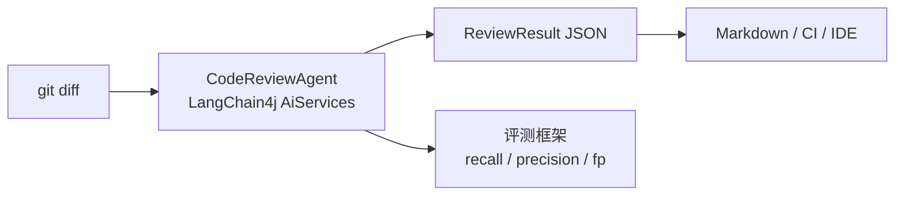
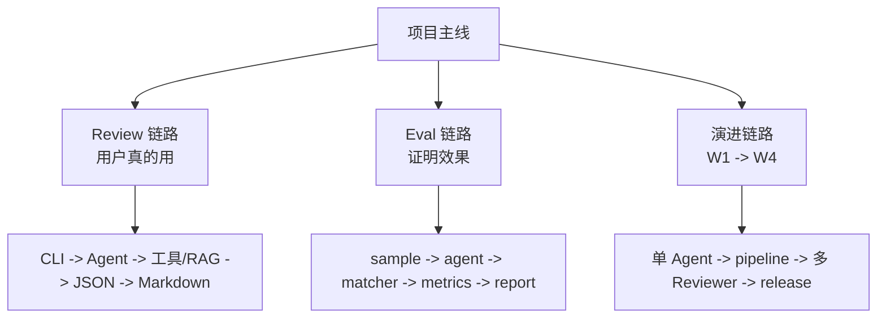
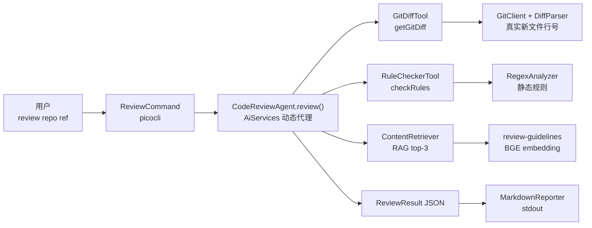
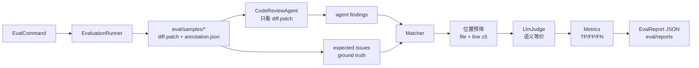
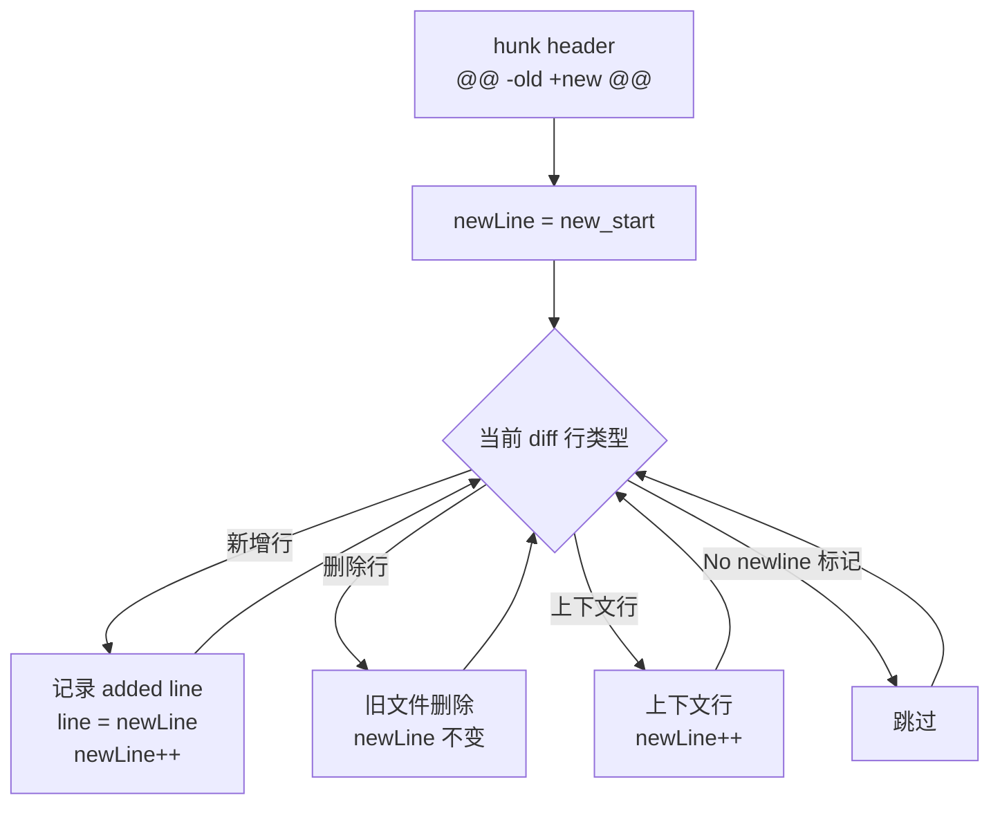
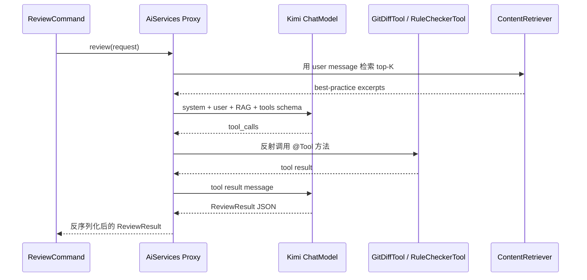
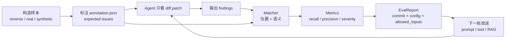
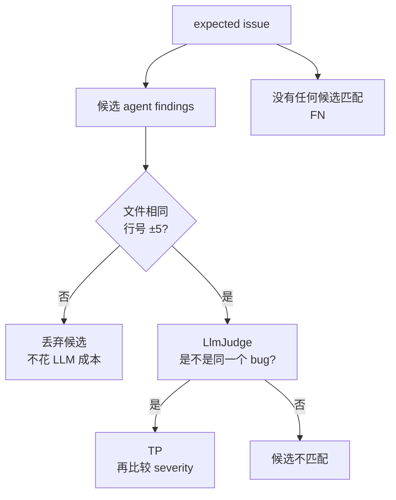
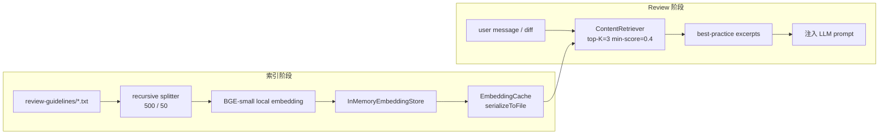
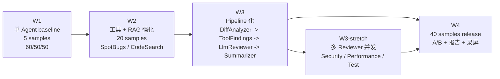

# Code Review Agent · 面试题库

> 针对本项目（W1 状态：单 Agent + 5 反向构造样本 + v0-baseline 60/50/50）整理的面试题与模型答案。涵盖大厂二三面常问的角度。
>
> **用法**：先通读一遍混个脸熟，再挑 3-5 个最容易卡的反复背骨架（不要背原话）。每题的「**答案要点**」是必须答出的核心 bullet，「**强答案样例**」是参考表达，「**踩雷**」是新人常见错答，「**追问准备**」是面试官顺势会问的下一个问题。

---

## 5 分钟速记地图

> 背诵方法：先把下面 5 张小图记住。面试时不要背全文，先在脑子里过图，再按「输入 → 处理 → 输出 → 评测」展开。

### 1. 项目一句话边界



**背诵抓手**
- 输入：`git diff`
- 核心：LangChain4j Agent + 工具 + RAG
- 输出：结构化 `ReviewResult`
- 差异化：评测先行，有 baseline 数字
- 当前数字：5 samples，recall 60%，precision 50%，FP 50%

### 2. 三条主线



**面试口述顺序**
1. 先讲 Review 链路，让面试官知道系统怎么跑。
2. 再讲 Eval 链路，体现你不是只会调 LLM。
3. 最后讲演进链路，说明你知道 W1 的边界和下一步。

### 3. 最容易被追问的 5 个点

| 追问点 | 一句话回答 |
|---|---|
| 为什么 Java | 求职定位是 Java 后端转 AI 应用，企业服务化也更顺 |
| 为什么 LangChain4j | 把 tool schema、function calling、JSON 反序列化和 RAG 注入交给框架 |
| 为什么单 Agent | W1 先把评测链路压稳，多 Agent 是亮点不是核心价值 |
| 为什么 JSON | JSON 给机器消费，Markdown 只是展示层 |
| 最大缺陷 | 样本少、token 统计缺失、RAG 没 A/B 验证 |

### 4. 口述总模板

```text
我做的是一个基于 LangChain4j 的代码评审 Agent。
输入是 git diff，输出是结构化 ReviewResult JSON，再渲染成 Markdown。
W1 先做单 Agent，不急着多 Agent，因为核心价值是评测可信。
评测侧用 reverse-style samples，Matcher 先按文件+行号预筛，再用 LLM judge 判语义等价。
当前 baseline 是 5 个样本，recall 60%、precision 50%，数字不大，但链路已经跑通。
```

---

## 目录

- [Ch.1 开场与项目叙事](#ch1-开场与项目叙事)
- [Ch.2 技术选型与取舍](#ch2-技术选型与取舍)
- [Ch.3 架构与数据流](#ch3-架构与数据流)
- [Ch.4 关键技术细节](#ch4-关键技术细节)
- [Ch.5 评测设计（重头戏）](#ch5-评测设计重头戏)
- [Ch.6 工程化、配置与测试](#ch6-工程化配置与测试)
- [Ch.7 性能、可观测与扩展](#ch7-性能可观测与扩展)
- [Ch.8 LLM / Agent 原理类](#ch8-llm--agent-原理类)
- [Ch.9 RAG 细节](#ch9-rag-细节)
- [Ch.10 演进路线与自我批判](#ch10-演进路线与自我批判)
- [Ch.11 反问环节](#ch11-反问环节)
- [附录 A · 陷阱题 / 高阶题](#附录-a--陷阱题--高阶题)

---

## Ch.1 开场与项目叙事

### Q1.1 简单介绍一下你这个项目

**答案要点**
- 输入是什么、输出是什么、用什么技术做的（一句话画出边界）
- 你做的差异化在哪里（用一句话答，不要堆 buzzwords）
- 当前进度 + 数字

**强答案样例**
> "做了一个基于 LangChain4j 的代码评审 Agent。输入是 git diff，输出是带文件 + 行号、按严重程度分级、带知识库引用的结构化评审报告。差异化是**评测先行**——W1 末尾就跑出了 baseline（召回 60% / 准确 50%），之后每加一个能力都重跑评测，所有改进有数字背书。"

**踩雷**
- ❌ "做了一个 AI 代码审查工具，用了 LangChain4j、Spring Boot、RAG……" → 堆栈罗列，没逻辑
- ❌ "目前还在做，准确率还不够" → 没数字 = 没工程方法

**追问准备**
- "和 SonarQube/Copilot Review 有什么区别？" → 见 Q1.3

### Q1.2 你为什么做这个项目？

**答案要点**
- 业务/技术痛点（不是兴趣使然）
- 想验证的技术假设
- 个人成长目标（Java 后端 → AI 应用方向）

**强答案样例**
> "两个动机。**技术上**，传统静态分析（SonarQube、SpotBugs）只能查规则化的死东西，发现不了语义级问题（比如改了缓存逻辑没同步改失效逻辑）；纯 LLM review 又有幻觉行号和不可复现两个老毛病。我想验证 Agent + 静态分析工具 + RAG 三者能不能在保留语义理解的同时，把行号和依据钉死。**个人上**，我是 Java 后端转 AI 应用，这个项目刚好用 Java 栈（LangChain4j）覆盖了 Agent、RAG、评测三个最热的话题。"

**踩雷**
- ❌ "想学一下 AI" / "看到 ChatGPT 很火"

### Q1.3 这个项目和 SonarQube / GitHub Copilot Review 有什么区别？

**答案要点**
- SonarQube：规则化、确定性、查不了语义；本项目补语义层
- Copilot Review：黑盒、不可定制、没有评测可信度；本项目结构化输出 + 评测框架
- 强调 **互补** 而不是替代

**强答案样例**
> "SonarQube 是**规则化引擎**——快、稳、可复现，但只能查模式匹配能写出来的东西，比如未关闭的 stream、空指针风险。我的项目里 `RegexAnalyzer` 就是这个层级，作为 deterministic 底盘。LLM 这层处理的是 **语义级问题**——比如『这个方法名叫 createUser 但实际上做了 update』、『加了缓存但没加失效』。Copilot Review 在体验上更接近，但它是黑盒，没有公开的评测数字，企业内私有代码也不好用。我的差异化是**输出结构化 + 评测可复现** —— ReviewResult JSON 可以被下游消费（CI 拦截、IDE 标注），eval/reports/ 里每个版本的指标可以追溯。"

**追问准备**
- "那为什么不直接用 SonarQube + Copilot 组合？" → 答：可以组合，但中间没有统一的结构化层；本项目的 `ReviewFinding` schema 就是这个统一层。

---

## Ch.2 技术选型与取舍

### Q2.1 为什么用 Java？AI 圈不都是 Python？

**答案要点**
- 我的栈是 Java（求职定位）
- 企业级代码评审场景，Java 服务化更顺
- LangChain4j 在 1.x 后能力已经够用
- **不死磕**：声明清楚选型边界

**强答案样例**
> "三个原因。**第一**，我是 Java 后端转 AI 应用，用 Java 能复用我的工程基础（Spring Boot、并发、配置）；**第二**，企业代码评审场景里 Agent 通常要长在已有 Java 服务上，比 Python 桥接顺；**第三**，LangChain4j 1.x 之后 AiServices、Tool、RAG 这些核心抽象都齐了，写 Agent 不比 Python 痛苦。我不会硬说 Java 比 Python 强——做模型训练、prototyping 我会切 Python，但做应用层、做产品工程化，Java 反而是优势。"

**踩雷**
- ❌ "Java 比 Python 快" / "Python 类型不安全" → 这类对线性论调容易被怼

### Q2.2 为什么用 LangChain4j 而不是自己写 ReAct loop？

**答案要点**
- AiServices 把工具路由、JSON 反序列化、RAG 注入封装了
- 自己写要解决：tool schema 生成、function calling 解析、retry、流式
- 我的精力放在工具实现和评测，不在 framework 层重复造轮子
- 知道 framework 的边界（不是甩锅）

**强答案样例**
> "我的核心价值在工具实现和评测上，不在重复 LangChain4j 已经做的事情。AiServices 帮我做了三件事：**一是** `@Tool` 注解自动生成 function calling schema 暴露给 LLM；**二是**自动把 LLM 返回的 JSON 反序列化成 `ReviewResult` record；**三是** `ContentRetriever` 自动把 RAG 检索结果注入到 user message 里。如果我自己写 ReAct loop，这三件事至少要写 500 行模板代码，还要自己处理 retry、token 计数、错误降级。"
>
> "我也清楚 framework 的边界——比如它对 tool 调用的失败重试策略不够灵活，W2 如果遇到瓶颈我会考虑用 lower-level 的 `ChatModel` API 自己控流。"

**追问准备**
- "AiServices 内部是怎么把 @Tool 暴露给 LLM 的？" → 答：用反射扫描带 `@Tool` 的方法，生成 OpenAI function calling 格式的 JSON Schema，每轮对话把 schema 发给 LLM，LLM 返回 `tool_calls` 后框架根据方法签名反序列化参数并反射调用。

### Q2.3 为什么用 Kimi（moonshot-v1-8k）而不是 GPT-4 / Claude？

**答案要点**
- 成本：Kimi 国内便宜很多
- 可访问性：境内无翻墙
- OpenAI 兼容接口：换模型零成本
- 8k context 现在够用（diff 已经按文件切分）

**强答案样例**
> "选型有三个考量。**成本**：Kimi 比 GPT-4 便宜一个数量级，跑评测每次几百 sample 不心疼。**可访问性**：境内不用翻墙，演示稳定。**接口兼容**：Moonshot 用 OpenAI 兼容接口，application.yml 只需要改 `base-url` 和 `model-name` 就能换 GPT-4 / DeepSeek，**模型选型**和**业务逻辑**是解耦的。8k context 现在够用——`GitDiffTool` 已经做了按文件切分 + 大文件摘要（单文件 4000 字符、总长 12000 字符上限），不会撑爆。W2 如果跑大仓库可能切到 128k 模型。"

**追问准备**
- "Kimi 和 GPT-4 在 code review 上效果差多少？" → 老实说：我没专门对比，但我有评测框架，可以一晚上跑完做 A/B。这正是 eval-driven 的好处。

### Q2.4 为什么用本地 BGE-small 嵌入不用 OpenAI embedding？

**答案要点**
- 离线、零依赖、求职演示场景无 API key 也能跑
- 知识库只有几个 txt，小模型够用
- 成本 0
- BGE-small-en quantized 包很小

**强答案样例**
> "BGE-small-en-v15-quantized 是 LangChain4j 提供的本地 ONNX 模型，启动即用，不需要 API key。我的知识库目前只有 review-guidelines 下的两个 txt（java best practices + security checklist），小模型完全够用。**离线**这一点对求职演示很重要——别人 clone 下来不需要 OpenAI key 也能跑。如果未来知识库扩到几百篇专业文档，再切到 BGE-large 或 OpenAI text-embedding-3-small。"

### Q2.5 这是个 CLI，为什么用 Spring Boot？不是太重了吗？

**答案要点**
- 用的是 `web-application-type: none`，没起 Tomcat
- 为了 `@ConfigurationProperties` 强类型配置 + `@Bean` 依赖注入
- 为了 picocli-spring-boot-starter 的 IFactory 集成
- 顺便铺路：W3/W4 如果要起 REST API（IDE 插件对接），扩展成本是 0

**强答案样例**
> "Spring Boot 这里是**配置 + DI 容器**，不是 Web 框架——application.yml 里 `web-application-type: none` 显式关掉了 Tomcat。我用它主要是三件事：**强类型配置**（`CodeReviewProperties` record + `@ConfigurationProperties` 自动绑定 yml）、**依赖注入**（GitClient、DiffParser、EmbeddingCache 这些组件通过构造器注入，方便测试时换 mock）、**picocli 集成**（`picocli-spring-boot-starter` 让 `@Command` 类可以注入 Spring bean）。冷启动大概 2-3 秒，可以接受。后续要做 IDE 插件接 REST API 直接打开就行。"

**踩雷**
- ❌ "因为我熟悉 Spring Boot" → 选型不能用『熟悉』当理由

### Q2.6 为什么 W1 用单 Agent 而不是一开始就上多 Agent？

**答案要点**
- 评测要先稳；先做单 Agent 跑通评测链路
- 多 Agent 不是默认更好（并发协调、token 翻倍、超时降级都是新问题）
- W3 计划：先 pipeline 化（DiffAnalyzer → ToolFindings → LlmReviewer → Summarizer），再考虑并发多 Reviewer
- "**多 Agent 是亮点，不是核心价值**"——这句话是 spec 里的原话

**强答案样例**
> "spec 里有句原话：『多 Agent 是展示亮点，不是核心价值』。我的核心价值是评测可信度。W1 先用单 Agent 跑通整个评测链路——指标公式稳定、Matcher 两层匹配跑通、5 个样本跑出 baseline，**这才是 v1/v2/v3 比较的基准**。如果一开始就上 5 个 Agent，问题暴露面太大：超时设多少、并发几路、找出来重复怎么去重、token 翻几倍——这些问题如果没有评测数字背书，调起来全是凭感觉。W3 我会先把单 Agent 拆成 pipeline（4 个确定性阶段），最后才并发多 Reviewer，每一步都用评测验证有没有提升。"

---

## Ch.3 架构与数据流

> 这一章要能“边说边画”。先画 Review 主链路，再补 Eval 链路。别一上来讲 LangChain4j 内部细节，先让面试官看到系统边界。

### Ch.3 背诵图 A：Review 主链路



**背诵抓手**
- 入口是 `ReviewCommand`，不是直接调模型。
- Agent 是 AiServices 生成的代理，负责 prompt、tool calling、RAG 注入、JSON 反序列化。
- 工具有两类：`GitDiffTool` 拿 diff，`RuleCheckerTool` 跑确定性规则。
- RAG 不是显式 tool，是 `ContentRetriever` 自动把知识库片段注入 prompt。
- 输出先是 `ReviewResult JSON`，Markdown 只是渲染层。

### Ch.3 背诵图 B：Eval 链路



**背诵抓手**
- Eval 的核心不是“跑一下 agent”，而是可复现地算指标。
- Agent 只能看 `diff.patch`，不能看 `annotation.json`。
- Matcher 两层：便宜的位置预筛，昂贵的 LLM judge。
- `EvalReport` 记录 commit、tag、allowed_inputs，用来回答“你有没有泄漏标注”。

### Q3.1 画一下你这个系统的数据流

**答案要点**
- 从用户输入开始，到结构化输出结束
- 关键 4 步：CLI 解析 → Agent 调度（含工具 + RAG）→ ReviewResult JSON → Markdown 渲染
- 评测路径并行存在

**强答案样例（口述时画一下也行）**
> "数据流分两条。**Review 路径**：用户在命令行输入 `review <repo> <ref>`，picocli 路由到 `ReviewCommand`，组装一段 user message 调 `CodeReviewAgent.review()`。Agent 是 LangChain4j AiServices 实例，框架做三件事——把 prompt + RAG 检索结果（自动从 knowledge base 拉 top-3）发给 Kimi，LLM 根据 system prompt 决定先调 `getGitDiff` 再调 `checkRules`，框架反射调用工具拿到结果再发回 LLM。LLM 最终返回 JSON，框架反序列化成 `ReviewResult`。最后 `MarkdownReporter` 渲染成人类可读 Markdown 打到 stdout。
>
> **Eval 路径**：`EvalCommand` 调 `EvaluationRunner`，每个样本读 `diff.patch`（不读 annotation！），调 agent 拿到 findings，过 `Matcher`——先位置预筛（文件 + 行号 ±5），再过 `LlmJudge` 判语义等价。最后 `Metrics` 算 recall/precision/fp/severity，写 `EvalReport` JSON。"

**追问准备**
- "LLM 怎么知道要先调 getGitDiff 再调 checkRules？" → 答：system prompt 里显式写了 workflow 顺序（"Call getGitDiff first, then checkRules"）。这是**软约束**，温度=0 + 明确顺序基本能稳定执行。W2/W3 会改成 pipeline 强约束。

### Q3.2 ReviewResult 为什么设计成 JSON 而不是直接 Markdown？

**答案要点**
- **消费者不同**：JSON 给评测/CI/IDE，Markdown 给人
- 结构化字段（severity/category/file/line）便于程序处理
- Markdown 是渲染层，可以多套（CLI Markdown / GitHub PR comment / SARIF）

**强答案样例**
> "因为 review 的产物有两类消费者：**机器**（评测 Matcher 要按文件+行号匹配、CI 要按 severity 决定是否拦截、IDE 要按 line 标注）和**人**（开发者看报告）。如果直接生成 Markdown，机器要回头解析 Markdown，又是一层不稳定。所以我把**数据**和**展示**分两层——LLM 产 JSON，`MarkdownReporter` 渲染。同样的 JSON 未来可以渲染成 GitHub PR comment、SARIF、HTML，零成本。"

### Q3.3 这个 system prompt 你怎么设计的？

**答案要点**
- 角色 + 工作流 + 约束 + 输出格式
- 约束部分明确枚举（severity/category 枚举值）
- "空结果也要返回 summary" 防止 LLM 空跑
- 强调 "use new file line numbers"（修历史 bug 的体现）

**强答案样例**
> "system prompt 分四块：**角色**（senior software engineer doing a code review）、**工作流**（先 getGitDiff 再 checkRules，RAG 结果会自动注入）、**约束**（severity/category 枚举值、source 字段语义、line 必须是 post-change 行号）、**输出格式**（ReviewResult JSON schema 字段列举）。
>
> 三个细节值得讲：**第一**，明确枚举值——LLM 不会自创 severity，否则反序列化炸；**第二**，无 finding 也要返回 summary 解释——避免空跑被当成 LLM 罢工；**第三**，专门强调 'line numbers must match the new file'——这是修历史 bug 的体现，DiffParser 给的是文件行号，但 LLM 看 diff 时容易看到 @@ -10,5 +12,7 @@ 这种 hunk header 就乱算。"

---

## Ch.4 关键技术细节

> 这一章的背诵策略：不要背实现细枝末节，背“状态怎么流动”。DiffParser 背行号计数器，AiServices 背 tool-call 循环。

### Ch.4 背诵图 A：DiffParser 行号推进



**背诵抓手**
- 只维护“新文件行号”这一个核心状态。
- `+` 和空格行会推进新文件行号，`-` 不会。
- RegexAnalyzer 后面拿到的已经是文件真实行号，不用关心 diff 格式。
- 老 bug：以前把 diff 内部偏移当文件行号，导致报告位置错。

### Ch.4 背诵图 B：AiServices 调用循环



**背诵抓手**
- AiServices 本质是动态代理，不是你手写循环。
- `@Tool` 方法会变成 function calling schema。
- LLM 返回 `tool_calls` 后，框架反射调用 Java 方法。
- 最终 JSON 反序列化成 `ReviewResult` record。

### Q4.1 DiffParser 怎么把 diff 行号映射到文件行号？

**答案要点**
- unified diff 的 hunk header 格式：`@@ -old_start,old_count +new_start,new_count @@`
- 解析时维护 "当前新文件行号" 计数器
- 遇到 `+` 行计数器++，遇到 `-` 行不变，遇到 ` ` 行（context）计数器++
- 跳过 `\ No newline at end of file`

**强答案样例**
> "unified diff 的 hunk header 是 `@@ -10,5 +12,7 @@`，意思是『旧文件第 10 行开始 5 行、新文件第 12 行开始 7 行』。我从 `+12` 起算 `newLine = 12`，逐行扫描：`+ xxx` 是新增——记录到 `addedLines` 并 `newLine++`；`- xxx` 是删除——`newLine` 不变；` xxx` 是 context——`newLine++`。这样每个 added line 都带着真实的新文件行号。
>
> **修过的老 bug**：以前的实现把 diff 字符串里的偏移行号（diff 里第几行）当成文件行号传给 LLM 和 RegexAnalyzer，下游报的位置全错。DiffParser 引入后 RegexAnalyzer 拿到的 `FileDiff` 已经是带正确行号的，写规则的人不用关心 diff 格式。"

**追问准备**
- "如果一个 hunk header 是 `@@ -1 +1 @@`（省略 count）你怎么处理？" → 默认 count=1
- "二进制文件 / rename 怎么处理？" → 跳过 / 只记 path

### Q4.2 AiServices 内部是怎么工作的？

**答案要点**
- 接口 + 注解定义 → 框架用 JDK Proxy 生成实现
- @SystemMessage / @UserMessage → 拼 prompt
- @Tool 方法 → 反射扫 → 生成 function calling schema
- 多轮：LLM 返回 tool_calls → 框架反射调用 → 把结果塞回 messages → 再调 LLM → 直到 LLM 返回 final answer
- 最后用 Jackson 把 JSON 反序列化成返回类型

**强答案样例**
> "AiServices 本质是 **JDK 动态代理 + 反射调用工具**。我定义了一个 `CodeReviewAgent` 接口，框架通过 `Proxy.newProxyInstance` 生成实现。调 `review(...)` 时框架做这些事：
>
> 1. 读 `@SystemMessage` 和 `@UserMessage` 拼成 messages
> 2. `ContentRetriever` 拿 user message 去 embedding store 检索 top-K，把结果作为额外的 system context 注入
> 3. 扫所有注册的 tool 类（`GitDiffTool` / `RuleCheckerTool`），把 `@Tool` 方法生成 OpenAI function calling JSON Schema
> 4. 发请求 → LLM 可能返回 `tool_calls` → 框架按 method name 反射调用，参数用 Jackson 反序列化
> 5. 把 tool 结果作为 `tool` role message 塞回去，再次请求 LLM
> 6. 循环直到 LLM 返回纯文本 JSON（无 tool_calls）
> 7. 用 Jackson 把 JSON 反序列化成 `ReviewResult` record"

**追问准备**
- "@Tool 方法的参数是怎么知道 LLM 传过来的 JSON 字段对应哪个 Java 参数？" → `@P` 注解给参数描述，框架按位置和类型对齐。Jackson 反序列化。

### Q4.3 GitDiffTool 的长 diff 截断策略

**答案要点**
- 两层：单文件 4000 字符上限、总长 12000 字符上限
- 单文件超限：保留 hunk header + 最多 20 行 added lines 的摘要
- 总长超限：直接截断 + 标注剩余文件数
- 阈值是经验值，可以用评测调优

**强答案样例**
> "现在是两层硬阈值：**单文件**超 4000 字符就只保留 diff 头部 400 字符 + 最多 20 行 added lines 的摘要；**总长**超 12000 字符直接截断剩余文件并显式告知 LLM『truncated, N files total』，让它知道自己没看全。
>
> 这两个数字是经验值——Kimi 8k context、prompt + RAG ≈ 2k、ReviewResult 输出预留 2k，剩 4k 留给 diff，按平均 token≈3 char 算大约 12k 字符。**W2 我会用评测调**：跑同一 sample set 用不同阈值，看 recall 在哪个点开始下降。"

### Q4.4 EmbeddingCache 是怎么序列化 EmbeddingStore 的？

**答案要点**
- LangChain4j InMemoryEmbeddingStore 自带 `serializeToFile` / `loadFromFile`（JSON）
- 我加了**路径清洗**（key 里的 `/` 替换避免越权）
- 缓存 key = 知识库标识 `review-guidelines`
- 命中直接 load，miss 重新嵌入再 save

**强答案样例**
> "InMemoryEmbeddingStore 自带 JSON 序列化。我封一层 EmbeddingCache，做两件事：**路径安全**——cache key 里的 `/`、`..` 都要清洗，避免传入恶意 key 时写到 cache 目录之外；**版本控制**——目前 key 就是 `review-guidelines`，W2 知识库扩了之后会加 hash 作为 key 一部分，知识库一变 cache 自动失效。"

### Q4.5 静态分析器为什么抽 StaticAnalyzer 接口？

**答案要点**
- 策略模式：W1 只有 Regex，W2 加 SpotBugs，W3+ 加 CodeSearch
- Spring 自动注入 `List<StaticAnalyzer>`，新增一个 `@Component` 就生效
- 每个 analyzer 实现 `analyze(List<FileDiff>) → List<Violation>` 单一职责
- 失败降级：单个 analyzer 抛异常不影响其他

**强答案样例**
> "为了扩展性。W1 只有 `RegexAnalyzer`，W2 要加 SpotBugs（可能不可用要降级），W3+ 还可能加 CodeSearch / AST-based。所有 analyzer 实现同一个 `StaticAnalyzer` 接口（`name()` + `analyze(files)` → `List<Violation>`），Spring 自动注入成 `List<StaticAnalyzer>` 到 RuleCheckerTool。新增分析器只需 `@Component` 标注，调用方零改动。**降级策略**：单个 analyzer 抛异常会 catch 后继续跑其他，不会因为 SpotBugs 装不上整个 review 罢工。"

---

## Ch.5 评测设计（重头戏）

> 这一章是面试官最爱深挖的地方。**会算指标的人很多，会设计评测的人很少**——你的差异化全在这里。

### Ch.5 背诵图 A：评测闭环



**背诵抓手**
- 评测不是一次性报告，而是“样本 -> 指标 -> 改进 -> 再跑”的闭环。
- `allowed_inputs` 是审计点：证明 agent 没偷看答案。
- W1 的 5 个样本不负责统计显著性，只负责把管道跑通。

### Ch.5 背诵图 B：Matcher 两层匹配



**背诵抓手**
- 第一层是降本，不是最终判断。
- 第二层判语义等价，不判“谁写得更好”。
- 重复 finding 当前会多算 FP，这是 W2 要修的已知取舍。

### Ch.5 指标小抄

| 指标 | 公式 | 面试时怎么解释 |
|---|---|---|
| Recall | `TP / (TP + FN)` | 真问题里抓到了多少 |
| Precision | `TP / (TP + FP)` | 报出来的问题里有多少是真的 |
| FP rate | `1 - precision` | 当前样本设计里等价于误报比例 |
| Severity accuracy | `severity matched TP / TP` | 已经抓对的问题，严重程度分对了多少 |

### Q5.1 你的核心指标怎么定义？分母是什么？

**答案要点**
- **Recall** = TP / (TP + FN) = 抓到的真问题数 / 所有真问题数
- **Precision** = TP / (TP + FP) = 抓到的真问题数 / Agent 报告的总 finding 数
- **FP rate** = FP / (TP + FP) = 1 - precision（在我这个上下文里）
- **Severity accuracy** = severity 匹配的 TP / 所有 TP
- 所有指标都是按 sample 算再聚合（不是 micro/macro 的事）

**强答案样例**
> "三个核心指标加一个辅助指标：
>
> - **Recall** = TP / (TP + FN)：annotation 里标注的真问题，Agent 抓到几个；分母是 ground truth 总数
> - **Precision** = TP / (TP + FP)：Agent 报的 finding 里有几个是真的；分母是 Agent 总产出
> - **FP rate**：我现在按 1 - precision 算，因为没有『负样本总池』
> - **Severity accuracy** = severity 匹配数 / 已 match 的 TP 数：分母只算已经 TP 的 finding，因为 severity 在 FN 上没有意义
>
> 所有指标 per-sample 算了再求平均，没有用 micro-average——sample 量小时 micro 容易被某个大样本带偏。"

**追问准备**
- "FP rate 和 precision 重复了？" → 在我现在的样本设计里是 1-1 对应，但当未来加入"负样本（没问题的 PR）"后，FP rate 会变成 `FP / (TN + FP)`，定义变化。

### Q5.2 Matcher 两层匹配，第一层为什么是 ±5 行？

**答案要点**
- 第一层是位置预筛，**降本**——位置不匹配的 pair 不用调 LLM
- ±5 是经验值，理由：LLM 偶尔把同一个问题报到相邻行（缺空行/import 位置之类）；reverse-style sample 是手工标注，标注者也有 1-2 行偏移
- 太紧（±0）召回掉得快；太松（±20）失去预筛意义
- W2 会用评测调

**强答案样例**
> "第一层是位置预筛，**目的是降本**。LLM judge 调用昂贵，我先用『文件名相同 + 行号 ±5 容差』把不可能匹配的 pair 砍掉。±5 是经验值——LLM 偶尔把同一个语义问题报到相邻行（比如 import 顺序、空行问题），人工标注也有 1-2 行偏差，5 行的窗口能 cover 这些。**没匹配上**也不会立刻判 FN，会和所有候选 finding 都比一遍，全没过预筛才 miss。**第二层** LLM judge 才是判定真假——只看预筛过的 pair，问 LLM 『这两个发现说的是不是同一件事』，避免字符串匹配带来的措辞偏差。"

### Q5.3 LLM-as-judge 不会有自我偏好吗？

**答案要点**
- 是有偏差风险——同一个 LLM 既当被评测者又当裁判
- 我的缓解：judge 只判**等价性**不判**质量**（"这两段说的是不是同一个 bug"），等价判断比质量判断稳很多
- W4 会做 cross-model judge（用另一个模型当裁判验证一致性）
- runs_per_sample=3 求平均，降低单次波动

**强答案样例**
> "这是 LLM-as-judge 的经典风险——self-preference bias。我做了三件事缓解：**第一**，judge 只判**等价性**（『这两个 finding 是不是同一个 bug』）不判**质量**（『这两个谁更好』），等价判断的歧义小很多，裁判稳定性高；**第二**，runs_per_sample W1 是 1，release 会调到 3 求平均；**第三**，W4 计划用 cross-model judge——主 Agent 用 Kimi，裁判用 DeepSeek 或 Qwen，定期跑一致性检查，如果差异 > 10% 就要复核。**老实说**，5 个 sample 现在还看不出明显 bias，等扩到 20-40 sample 再看。"

### Q5.4 你的样本量太小了——5 个能说明什么？

**答案要点**
- 承认：W1 不追求样本量，追求**评测链路稳定**
- 5 个的目的是把 DiffParser、Metrics、Matcher、Runner 跑通
- W2 扩到 20、W4 扩到 40
- 用置信区间表达不确定性

**强答案样例**
> "完全同意 5 个不够下结论。spec 里我明确写过 『W1 不追求样本量，追求评测链路可信』——5 个的目的是把 DiffParser 行号、Metrics 公式、EvaluationRunner 报告产出跑稳，先把『管道』压通。
>
> **统计性**：n=5 的二项分布，60% 召回的 95% 置信区间大概是 [15%, 95%]，等于啥都没说。我对外不会单独 quote 这个 60%，而是 quote 『**v0 baseline，5 样本 W1 收尾点**』，留给 v1/v2 比较参考。W2 扩到 20 之后置信区间会收敛到 ~±20%，W4 40 个能到 ~±15%，才算有意义。
>
> **另一个补强**：runs_per_sample 在 release 会跑 3 次取平均，进一步降低 LLM 波动带来的噪声。"

**追问准备**
- "为什么不一开始就跑 40 个？" → 标注成本。每个反向构造样本需要：找原仓 → 找一个好 PR → 反向改成 broken → 写 annotation.json → 人工 review。一个 sample 大概 30-60 分钟。

### Q5.5 reverse-style sample 是什么？为什么用它？

**答案要点**
- "反向构造"：拿一个**已修复**的 PR，反过来用——把『修对的版本』作为 source-after，把『有 bug 的版本』作为 source-before
- 让 agent review `source-before → source-after` 的**逆向 diff**（broken → fixed），告诉它"这是新 PR"看它能不能找出 bug
- 好处：ground truth 明确（提交记录里有真实修复说明）、标注成本低
- 坏处：bug 可能太"教科书"，不够真实多样
- W2 会补真实 PR（real-NNN/）和合成边界（synthetic-NNN/）

**强答案样例**
> "Reverse-style 的意思是『**把修过的 bug 反向变回去当样本**』。流程：从一个开源项目找一个『修 bug 的 PR』，把修复**前**的版本当成 diff 的 after 状态，把修复**后**的版本当 before——也就是构造一个『把代码改坏』的 diff，让 agent review，看它能不能识别出这其实是把代码改坏了。**好处**：ground truth 是真实的（PR 描述里写清楚了 fix 了什么），标注成本低，不用我凭空想 bug。**坏处**：构造出来的 diff 有点不自然（真实 PR 不会有人故意改坏代码），所以 W2 会补 10 个真实 PR（`real-NNN/`）和 10 个手工合成的边界 case（`synthetic-NNN/`），三种类型一起跑评测。"

**追问准备**
- "数据污染怎么办？LLM 可能学过这些开源仓库" → 见 [附录 A · Q-A.3](#附录-a--陷阱题--高阶题)

### Q5.6 EvalReport 里为什么要记 commit hash 和 allowed_inputs？

**答案要点**
- **可复现**：commit + tag 锁定代码版本
- **样本隔离审计**：allowed_inputs 显式声明 agent 看了什么、没看什么（不让 `annotation.json` 泄露）
- 是 spec §5.7 的硬性要求

**强答案样例**
> "两个理由。**复现**：commit hash + git tag 记下来，未来 v0→v1→v2 对比时能精确知道每个版本对应的代码状态，避免『v1 跑出来的指标其实是 v1.5 的代码』这种乌龙。**审计**：`allowed_inputs: ['diff.patch', 'source-before/']` 显式声明 agent 看到了什么——这是评测可信度的关键。如果某天有人质疑『你 60% 召回是不是偷偷把 annotation 喂给了 agent』，我可以指着这个字段说：约束在代码里。**对应 spec §5.7 的可复现要求**。"

### Q5.7 你的指标里 input_tokens / output_tokens 全是 0，怎么回事？

**答案要点**
- 诚实说：W1 还没实现 token 统计，是已知 gap
- LangChain4j ChatModel 调用回包里有 TokenUsage，需要 hook 进去
- W2 会修
- 不是 bug 是 TODO，记得在 spec 里

**强答案样例**
> "这是 W1 已知的 gap，**不是 bug 是 TODO**。LangChain4j 的 `ChatResponse` 里有 `TokenUsage`，但 AiServices 这层默认没把它暴露给调用方——我需要加一个 `ChatModelListener` 或者用 lower-level API 手动统计，然后塞进 `SampleMetrics`。W2 第一件事就是把它接上，因为 token 是成本核算的核心。我特意把字段保留在 EvalReport schema 里、值置 0，是为了让 schema 稳定——这样 v1 跑出来的 report 和 v0 schema 兼容，可以一起 diff。"

**踩雷**
- ❌ 编理由说"这个数字不重要" → 面试官立刻知道你在心虚

### Q5.8 如果同一个 bug 被 agent 报了两次（行号不同但语义相同），怎么算？

**答案要点**
- 当前实现：第一个匹配 TP，第二个会被算 FP（因为 expected 只有一个对应项）
- 这有点不公平——不能因为 agent 更"啰嗦"就罚两次
- 改进方向：先对 agent 自己的 findings 做去重（基于 LLM judge 判语义等价）再算 precision
- 是已知设计取舍，W2 会调

**强答案样例**
> "现在的实现里，agent 报两次相同语义的 finding，只有第一个能匹配上 expected（被算 TP），第二个没 expected 配对会被算成 FP（因为 `findings.size() - tp` 直接当 FP 数）。**这有点不公平**——agent 啰嗦不等于错。
>
> **改进方向**：在 Matcher 入口先对 agent 自己的 findings 做内部去重（同一文件、同行范围、过 LLM judge 判等价的合并），再走 expected 匹配。W2 我会加这一步，因为多 Agent 上来后重复率会显著增加。**当前没做是因为** W1 单 Agent + 5 sample 下重复出现率几乎为 0，不值得提前优化。"

---

## Ch.6 工程化、配置与测试

### Q6.1 你的配置怎么分层？

**答案要点**
- `application.yml`：所有外部参数集中
- `CodeReviewProperties` record：强类型绑定
- 各组件通过构造器注入读自己关心的部分
- LLM/embedding 走 LangChain4j starter 的 `langchain4j.*` 命名空间

**强答案样例**
> "三层。**yml 文件**统一管理所有参数（LLM 配置、RAG top-K/min-score、eval samples-dir/report-dir、orchestration timeout/parallelism）。**`CodeReviewProperties`** 用 record + `@ConfigurationProperties(prefix='code-review')` 绑定，Spring Boot 启动时类型检查。**消费方**通过构造器注入对应 sub-record（`props.rag()` / `props.eval()`）。LLM 和 embedding 走 LangChain4j 提供的 starter 自动配置（`langchain4j.open-ai.chat-model.*`），不需要我手写 `ChatModel` Bean。"

### Q6.2 错误处理策略——LLM 调用失败、git 失败、工具失败怎么办？

**答案要点**
- 三层失败、三种策略
- **git 失败**：工具返回错误字符串（不抛），让 LLM 知道但继续；CLI 直接报错退出
- **工具失败**：单 analyzer 抛异常被 catch 不影响其他；返回错误信息进 ReviewResult.toolStatus
- **LLM 失败**：EvaluationRunner 里 catch 所有异常，标记 sample 为 review error 返回空 ReviewResult，不让一个 sample 把整个 eval 跑炸
- 整体哲学：**评测可恢复 > 单 sample 完美**

**强答案样例**
> "三层各有策略，核心哲学是『**评测可恢复 > 单 sample 完美**』。
>
> **git 失败**（仓库路径不存在、ref 无效）：`GitClient` 抛 `GitException`，被 `GitDiffTool` catch 后返回 `'Error running git diff: ...'` 字符串给 LLM——LLM 知道工具失败了，可以在 ReviewResult.toolStatus 里记录失败原因，而不是整个 review 罢工。
>
> **静态分析失败**：单个 analyzer 抛异常被 RuleCheckerTool catch 后跳过，其他 analyzer 继续；SpotBugs（W2）装不上时 RuleCheckerTool 退化到只跑 RegexAnalyzer。
>
> **LLM 失败**（超时、限流、5xx）：EvaluationRunner 里 try-catch 所有异常，把这个 sample 标记成 `ReviewResult.empty('review error: ...')`，TP=0、FN=expected.size()。这样 5 个 sample 里 1 个炸了，剩下 4 个的指标照常出，报告里能看到 'review error' 标记。"

### Q6.3 测试金字塔——你怎么测的？

**答案要点**
- 单元测试（DiffParser、Metrics、Matcher、各组件）
- Sociable test（GitDiffTool + GitClient 一起测）
- 集成测试（EvaluationRunnerIT 端到端，mock ChatModel）
- 不测：真实 LLM 调用（成本 + flaky）

**强答案样例**
> "三层。**单元**：DiffParser（fixtures `simple-add.patch` / `multi-file.patch` 校验行号映射）、Metrics（recall/precision 公式）、Matcher（位置预筛 + judge mock）。**Sociable test**：GitDiffTool 不 mock GitClient，用真实 git 进程跑临时仓库——这种测试更 robust，因为 git 行为是稳定的，mock 反而容易漂移。**集成测试**：`EvaluationRunnerIT` 用 mock 的 `ChatModel`（返回预设 JSON 字符串）跑完整 eval pipeline，验证 Sample.load → Agent → Matcher → Metrics → Report 全链路。**不测**真实 LLM 调用——贵 + flaky，专门用 eval suite 在 release 时跑。"

### Q6.4 怎么 mock ChatModel？

**答案要点**
- LangChain4j ChatModel 是接口，注入 mock 实现返回固定字符串
- 测试场景：判定 ReviewResult JSON 解析正确、tool 调用流程正确
- 集成测试要 mock 整个 LLM，因为 AiServices 是动态代理

**强答案样例**
> "ChatModel 是 LangChain4j 的核心接口（`chat(ChatRequest)` → `ChatResponse`），可以直接实现一个测试用的 fake：根据 input messages 的内容返回预设的 JSON。AiServices 会把这个 fake 接进 `AiServices.builder().chatModel(fake).build()` 生成测试 agent。`EvaluationRunnerIT` 里就是这么做的——fake 返回一个固定的 ReviewResult JSON，断言 EvaluationRunner 能跑完整 pipeline、产出 EvalReport。**不要 mock AiServices 接口本身**，那等于 mock 掉了你想测的逻辑。"

---

## Ch.7 性能、可观测与扩展

### Q7.1 当前 avg_latency 8 秒，瓶颈在哪？

**答案要点**
- LLM 调用是主瓶颈（2 轮：tool call round + final round），单轮 2-4 秒
- 静态分析 Regex 几乎可忽略（< 50ms）
- git diff 几十 ms 到几百 ms
- 优化方向：减少 LLM 轮数（pipeline 化）、流式输出、并发多 reviewer 时单路延迟拉到 ~4s（瓶颈是最长的那个）

**强答案样例**
> "瓶颈是 LLM 调用，**两轮**——第一轮 LLM 决定调 `getGitDiff`，返回工具结果；第二轮 LLM 决定调 `checkRules`，返回工具结果；第三轮（如果有）LLM 产出最终 JSON。每轮 2-4 秒，8 秒整体合理。其他组件——`DiffParser` 几 ms，`RegexAnalyzer` 几十 ms，git 子进程几百 ms。
>
> **优化方向有三**：**短期**——把 prompt 缩短、tools 描述精简，让 LLM 决策更快；**中期**——W3 pipeline 化，把 'LLM 决定调什么工具' 这一步去掉（DiffAnalyzer 和 ToolFindings 是确定性的 Java 代码，不过 LLM），只在 LlmReviewer 一步过 LLM，理论上能砍到 3-4s；**长期**——W3-stretch 多 reviewer 并发，单路延迟取决于最长的 reviewer，可能 4-5s。"

### Q7.2 大仓库（10000 行 diff）怎么办？

**答案要点**
- 当前 GitDiffTool 截断到 12000 字符
- 真实大 PR 需要分批 + 优先级
- 改进路径：按文件聚类 → 重要文件优先 → 一轮跑不完跑两轮 → 汇总
- 不要硬扛 context window

**强答案样例**
> "三层方案。**第一**，当前的硬截断（12000 字符）适合中小 PR；大 PR 会触发 truncate 警告，LLM 知道自己没看全。**第二**，针对大 PR 我会做**优先级排序**——按文件路径过 `.spotignore` / 类型（`*.test.*` 后置）、按改动行数取 top-N，先 review 关键文件。**第三**，**分批 review**——把大 PR 切成 N 个 chunk 分别 review，最后 Summarizer 合并。这种『大文档对大 LLM 不友好』的问题在 W3 多 Agent + W4 上 128k context 模型后会自然缓解，但 truncate + 优先级排序是底盘必须做的。"

### Q7.3 并发设计？你有 parallelism=3 但好像没用？

**答案要点**
- 当前 W1 是单 Agent，串行
- parallelism=3 是给 W3-stretch 多 Reviewer 留的——3 路并发（Security/Performance/Test）
- W2 评测如果用 `runs_per_sample=3` 也可以并发
- 现在配置预留是为了让 application.yml schema 稳定

**强答案样例**
> "诚实说，W1 没用上 —— 那个配置是给 W3-stretch 留的。多 Reviewer 设计是『SecurityReviewer / PerformanceReviewer / TestReviewer 并发跑，3 路同时调 LLM，最后 Summarizer 合并』，parallelism=3 就是这个并发度。W2 如果开启 runs_per_sample=3，也可以让 3 次 review 并发跑加速。**当前**保留这个配置项是为了让 yml schema 稳定，将来不用动配置文件。"

**踩雷**
- ❌ 编一个『当前已经在用并发』的故事——这种事一追问就穿帮

### Q7.4 这套系统能不能水平扩展？

**答案要点**
- 目前是 CLI，单进程
- LLM 调用是远程，天然无状态
- EmbeddingCache 是本地文件，扩展时需要共享存储或重新嵌入
- W4+ 如果做成 service：每个 review 请求一个临时 worker，水平扩 worker

**强答案样例**
> "CLI 现在是单进程，但**绝大部分状态在远端**：LLM 是 API、git 是只读本地、静态分析是无状态。唯一的本地状态是 EmbeddingCache，将来做成服务时把它换成 Redis / S3 + 启动时 warm 一次就行。**review 任务本身天然适合水平扩**——每个 PR 一个任务，无状态 worker，把任务塞到 MQ / SQS，N 个 worker pull 即可。我没把 W1 做成服务是因为求职演示 CLI 更直接，没必要堆复杂度。"

---

## Ch.8 LLM / Agent 原理类

### Q8.1 OpenAI function calling 工作流程？

**答案要点**
- 请求里附 `tools` 数组（function 定义 + JSON Schema）
- 模型返回 `tool_calls`：function name + arguments（JSON 字符串）
- 客户端执行 tool，把结果作为 `tool` role message 塞回去
- 再次请求模型，模型可能继续 call tool 或返回 final answer
- 多轮直到 stop

**强答案样例**
> "OpenAI 协议层定义了 function calling：请求 body 里附 `tools: [{type: 'function', function: {name, description, parameters: JSON Schema}}]`，模型如果决定调用，返回的 message 里 `tool_calls` 字段是非空的 `[{id, function: {name, arguments(JSON string)}}]`。**客户端**解析 arguments → 执行本地函数 → 把结果包成 `role: tool, tool_call_id: xxx, content: '...'` 加到 messages → 再发请求。模型可能继续 tool_calls 也可能给 final assistant message。LangChain4j 的 AiServices 把这套循环封装了——`@Tool` 注解扫描 + 反射调用 + 消息塞回。"

### Q8.2 temperature=0 是干嘛？还会有不稳定吗？

**答案要点**
- 减少采样随机性，给出概率最高的 token
- **不等于** deterministic——服务端 sampler、batching、infra 都可能引入抖动
- 实测同一 prompt 多次跑结果 90%+ 一致，但不是 100%
- 这就是 runs_per_sample=3 的另一个原因

**强答案样例**
> "temperature=0 让 sampler 永远取概率最高的 token，理论上确定，**实际上不是**——服务端的 batching、tie-breaking、infra-level 数值精度都可能让相同 prompt 跑出不同结果，OpenAI/Anthropic 都公开过这一点。实测 Kimi 同 prompt 跑 5 次大约 1-2 次会有局部差异（finding 数量、措辞）。**runs_per_sample=3 求平均**部分是为这件事兜底——单次跑可能 60% 召回也可能 80%，3 次平均更稳。"

### Q8.3 你的 Agent 是 ReAct 风格的吗？

**答案要点**
- 不是经典 ReAct（没有 Thought-Action-Observation 显式格式）
- 用的是 OpenAI function calling 风格（更现代）
- 区别讲清楚：ReAct 是 prompt-engineering，function calling 是 native model capability
- LangChain4j AiServices 默认 function calling

**强答案样例**
> "用的是 **function calling 风格**，不是 ReAct。区别：ReAct 是用 prompt 引导模型按 `Thought: ... Action: ... Observation: ...` 格式输出，客户端按文本解析；function calling 是模型 native 支持 tool 调用 schema、返回结构化 `tool_calls`，不依赖 prompt format。Function calling 更稳——不会因为模型偶尔输出格式错误就 crash，schema 校验在 framework 层做。**ReAct 在 2022-2023 是主流**，2024 后大模型基本都原生支持 function calling，prompt-driven 的 ReAct 用得少了。"

### Q8.4 LLM 输出的 JSON 不合法怎么办？

**答案要点**
- LangChain4j AiServices 反序列化失败会抛异常
- 我在 EvaluationRunner 顶层 try-catch，标记 sample review error
- 改进：response_format=json_object（OpenAI）、JSON 修复 lib、retry
- 当前实测下，temperature=0 + 明确 schema 描述基本不出错

**强答案样例**
> "三件事兜底。**第一**，prompt 里明确列举所有字段和枚举值，给 LLM 强结构约束。**第二**，温度=0 降低乱出格式的概率。**第三**，AiServices 反序列化失败时抛异常，被 EvaluationRunner catch，sample 标 review error 继续跑。**还可以做的**：开启 OpenAI/Moonshot 的 `response_format=json_object` 强制 JSON，或加一个 JSON 修复中间件（用小模型修），但 W1 实测下基本不出错，先不做。"

---

## Ch.9 RAG 细节

> RAG 这章不要讲成“我用了向量库”。重点是两段：索引侧怎么建，检索侧怎么进 Agent，以及 W1 还没证明它有效。

### Ch.9 背诵图：RAG 索引与检索



**背诵抓手**
- 索引阶段离线/启动时做：切 chunk、嵌入、缓存。
- 检索阶段每次 review 自动发生：`ContentRetriever` 用 user message 查 top-K。
- BGE-small 的理由：本地、零 API key、知识库小。
- W1 的缺口：没有 RAG A/B，也没有强制 citation 审计。

### Q9.1 你的 RAG 怎么用？

**答案要点**
- 索引：`review-guidelines/*.txt` → BGE-small 嵌入 → InMemoryEmbeddingStore（持久化到磁盘）
- 检索：每次 review 调 LangChain4j ContentRetriever，自动注入到 prompt
- 参数：top-K=3、min-score=0.4
- W2 计划：hybrid（BM25 + 向量）+ LLM reranker

**强答案样例**
> "索引侧：`KnowledgeBaseIndexer` 读 `review-guidelines/*.txt`（目前 java-best-practices、security-checklist 两篇），用 LangChain4j 的 `recursive(500, 50)` splitter 切 chunk，BGE-small-en-v15-quantized（本地 ONNX）嵌入，存到 `InMemoryEmbeddingStore`，再用 `EmbeddingCache` 序列化到 `~/.code-review-agent/cache` 避免每次启动重新嵌入。
>
> 检索侧：注册一个 `EmbeddingStoreContentRetriever` 到 AiServices 的 `contentRetriever`，框架自动用 user message 当 query 检索 top-3（min-score=0.4），把结果作为额外 context 注入到 LLM 请求里。**注意**——agent 不显式调 retrieval tool，是框架背后做的。"

### Q9.2 top-K=3、min-score=0.4 怎么调的？

**答案要点**
- 凭经验起点，没系统调
- 知识库只有 2 篇，每篇切成 ~5 chunk，top-3 已经覆盖大半
- min-score=0.4 防止低相关结果带噪音
- W2 用评测调

**强答案样例**
> "起点是经验值，没系统调过。**top-K=3** 是因为知识库只有两篇 txt，每篇切完大概 5-8 个 chunk，top-3 已经覆盖大部分相关内容；切太多反而稀释 prompt 焦点。**min-score=0.4** 是 cosine 相似度的中等阈值——0.5 以上比较严，可能少召；0.3 太松会引入噪音。**W2** 我会用评测调——固定 sample set，扫 top-K ∈ {2,3,5,10} × min-score ∈ {0.3,0.4,0.5}，看 recall/precision 曲线。"

### Q9.3 知识库才 2 篇 txt，会不会太薄？

**答案要点**
- 是的，W1 故意不堆数量，先把链路跑通
- W2 计划扩到 8-10 篇（Java/SQL/安全/性能/接口/异常/并发/测试）
- 知识库不是越多越好——稀释 top-K 选择、增加噪音
- 真正决定 RAG 效果的是 chunk 切分、检索召回、re-rank

**强答案样例**
> "对，W1 故意不堆数量——堆多了我没法验证 RAG 真的在起作用，可能召回的全是无关内容。W2 计划扩到 8-10 篇覆盖 Java/SQL/安全/性能/接口/异常/并发/测试。**但更重要的**是 W2 的 hybrid RAG（BM25 + 向量召回融合）和 LLM-as-reranker——只堆数量但召不准没意义。每加一篇我都会跑评测，如果 recall 不升反降说明加了噪音，要么删要么重写。"

### Q9.4 你怎么知道 RAG 真的在起作用？

**答案要点**
- W1 严重缺失 —— 老实承认
- 改进路径：A/B 评测（开/关 RAG）对比指标
- 引用溯源（citation 字段）是 W2 重点——LLM 必须引用具体规范条目，可以审计

**强答案样例**
> "**老实说 W1 没专门验证**——只能凭 prompt 里的指令推测 LLM 在用 RAG。这是 W1 已知的 gap。
>
> **W2 改进**：**第一**，跑 A/B 评测——关掉 `contentRetriever` 跑一遍 baseline，对比开启时的 recall/precision；**第二**，prompt 改造让 LLM 必须填 `citations` 字段——每条 finding 引用具体的规范条目（『违反 java-best-practices §3.2』），评测时审计 citation 是否真的存在于知识库。这两件事做完，RAG 是不是在起作用就是 evaluative 的，不是凭感觉。"

---

## Ch.10 演进路线与自我批判

> 这一章的目标不是显得项目完美，而是显得你有工程判断：知道 W1 哪些东西是故意不做，哪些是真缺陷，下一步怎么用评测验证。

### Ch.10 背诵图：W1 到 W4 演进路线



**背诵抓手**
- W1 的价值：先把 baseline 和评测链路跑通。
- W2 的价值：补工具、补样本、验证 RAG。
- W3 的价值：把“LLM 决定流程”变成确定性 pipeline。
- W4 的价值：release 级交付，指标、报告、可复现材料齐全。

### Ch.10 自我批判三件套

| 缺陷 | 为什么严重 | 怎么补 |
|---|---|---|
| 样本量太小 | 5 个样本没有统计显著性 | W2 到 20，W4 到 40 |
| token 统计缺失 | 没法讲成本和性价比 | 接 `ChatModelListener` 或 lower-level API |
| RAG 没验证 | 不知道知识库是否真有帮助 | 开/关 RAG A/B + citation 审计 |

### Q10.1 这个项目你最大的遗憾/缺陷是什么？

**答案要点**
- 选 1-2 个真实缺陷诚实说
- 立刻给改进路径（不是单纯吐槽）
- 候选：样本量、token 统计缺失、单 Agent 局限、RAG 没验证

**强答案样例**
> "三个我都不太满意，按严重度排：
>
> **一、样本量太小**——5 个 sample 的统计 power 太弱，60% 召回的置信区间宽得没意义。W2 扩到 20、W4 到 40 是必须的。
>
> **二、Token 统计缺失**——`avg_input_tokens` / `avg_output_tokens` 现在都是 0，因为我没接 `ChatModelListener`。这是 evaluative 项目的硬伤，成本核算不全。W2 第一件事修。
>
> **三、RAG 没做 A/B 验证**——我不知道 RAG 是不是真的在起作用，只是凭 prompt 假设它在用。W2 跑开/关对比就能知道。
>
> 这三个都是『**评测想真正可信**』的核心，所以我会在 W2 优先解决。"

**踩雷**
- ❌ 说"没有什么缺陷"或"都是小问题" → 立刻失去信任
- ❌ 吐槽完不给改进 → 像抱怨而不是工程师反思

### Q10.2 让你重做，你会怎么改？

**答案要点**
- 不是推翻重来，而是**调整迭代顺序**
- 把 token 统计放在第一周
- 更早做 RAG A/B
- 样本采集和写代码并行（W1 在第一天就开始收集）
- 单 Agent 不重做（这个选择正确）

**强答案样例**
> "**不会推翻**核心架构——AiServices + 工具 + RAG + 评测的组合还是对的；**单 Agent 先行**也是对的。我会调整迭代顺序：
>
> 1. **第一天就采集样本**：W1 我先写代码再采样本，导致最后两天压力大。如果重做，第一天起就同步采，写代码的时候用真实样本边写边验。
> 2. **token 统计放进 W1**：现在留到 W2 是个错，因为没 token 的指标对外讲不完整。
> 3. **RAG A/B 评测做进 baseline**：v0 应该出两个数字——RAG 开和关，明确证明 RAG 的边际收益。
> 4. **MarkdownReporter 延后**：W1 它不在核心路径上，最后再写没关系，早写挤压了评测时间。"

### Q10.3 W2/W3/W4 的核心动作是什么？

**答案要点**
- W2：SpotBugs + CodeSearchTool + 20 样本 + hybrid RAG + reranker + v1/v2
- W3：单 Agent pipeline 化（4 阶段）+ 可选多 Agent
- W4：40 样本 release + 调优 + 报告
- 每周末跑评测出指标

**强答案样例**
> "**W2** 工具 + RAG 强化：集成 SpotBugs（可降级）、加 CodeSearchTool（基于本地仓库 grep + 简化 AST）、把样本补到 20 个、知识库扩 8-10 篇、上 hybrid RAG（BM25 + 向量）+ LLM reranker、引用溯源（citation 字段必填）。期末跑 v1/v2 评测。
>
> **W3** Pipeline 化 + 可选多 Agent：先把单 Agent 拆成 DiffAnalyzer → ToolFindings → LlmReviewer → Summarizer 四阶段（确定性 + LLM 解耦）；如果时间够再加 SecurityReviewer / PerformanceReviewer / TestReviewer 并发跑。期末跑 v3 / v4-stretch。
>
> **W4** 评测补足 + 调优 + 交付：补 10 真实 + 10 合成边界到 40 个样本，用 git tag 重跑 v0-v3 指标做对比曲线图，针对 evaluation 暴露的问题调 prompt / 阈值，最后 README 重写 + 架构图 + 录屏 + commit history 整理。"

### Q10.4 你怎么判断什么时候应该停？

**答案要点**
- 不是无限优化——指标提升曲线变平就停
- 设定目标（比如 W4 召回 75% / 准确 70%）
- 边际收益评估：花一周提 2 个点 vs 修一个其他短板，选后者
- 项目有 4 周硬期限

**强答案样例**
> "判断标准是『**边际收益 vs 时间成本**』。每周末跑评测，如果一个改动 recall 提了 5+ 个点，继续这个方向；如果只提 1-2 个点，转向其他能力（比如 RAG 调完转去做工具）。**硬期限**是 4 周——W4 末必须有 40 样本 release 指标 + README + 录屏，所以 W3 必须留 buffer 给 W4 整理交付，不能为多 Agent 把交付时间挤没。"

---

## Ch.11 反问环节

> 反问体现你对岗位的真实兴趣 + 工程师 sense。准备 3-5 个，**不要问 HR 题**（薪资、加班）。

**好的反问**

1. **团队层面**："你们团队现在有没有在做类似的 LLM 应用化（review/PR 助手/RAG）？技术栈用什么？"
2. **评测层面**："团队对 LLM 产出的可信度是怎么评估的？有没有内部 eval set？"
3. **模型层面**："团队主要用什么模型？是 API 还是自部署？为什么这么选？"
4. **方向层面**："如果加入团队，前 3 个月最希望我做出什么样的产出？"
5. **挑战层面**："这个岗位你觉得最难做出来的事情是什么？"

**踩雷反问**

- ❌ "工作时间几点到几点？"
- ❌ "加班严重吗？"
- ❌ "我面试表现怎么样？"
- ❌ "这个公司在做什么？"（你不查岗位介绍？）

---

## 附录 A · 陷阱题 / 高阶题

### Q-A.1 如果 LLM 报了一个 finding 但 ground truth 没标，是 FP 还是它发现了新 bug？

**答案要点**
- 当前算 FP——简单粗暴但可能罚 agent
- 改进：把 unmatched findings 人工 review，区分『真 FP』和『漏标的真 bug』
- 漏标的真 bug 反过来补到 annotation（评测自我增强）
- 这是 ML labeling 里经典的 "active learning" 思路

**强答案样例**
> "当前算 FP——简单但可能误伤 agent。**真正的做法**应该是 unmatched findings 人工 review：如果是真 FP（agent 编了个不存在的 bug），保留 FP 计数；如果是漏标（agent 找到了人没标的真 bug），把它加进 annotation.json 里，下次跑 v1 时这条就是 TP。这是 active learning 的思路——**评测数据通过 agent 输出自我增强**。但要注意防自循环：agent 自己标的 ground truth 不能直接信，必须人工 confirm。"

### Q-A.2 reverse-style sample 是不是会让 agent 学会某种"作弊"？

**答案要点**
- agent 没有持久记忆，每次都是 stateless
- 但 LLM 可能在预训练时见过这些开源仓库（数据污染）
- 缓解：选小众或 recent PR（训练截止之后）、合成样本
- 这是 LLM-based evaluation 的根本难题，不是这个项目独有

**强答案样例**
> "Agent 本身 stateless 不会作弊，但 LLM **预训练数据可能见过这些开源仓库**——这是 LLM-as-evaluatee 的根本污染问题。两个缓解：**第一**，选训练截止之后的新 PR（比如 2025 年的）；**第二**，W2 加合成样本（`synthetic-NNN/`）——我自己手工构造从未公开的 bug，污染风险最小。**完全消除**不可能——任何静态 sample 都可能被未来的模型看到，所以评测集应该**定期轮换**，把已经被广泛传播的 sample 退役。"

### Q-A.3 如果让你给这个项目找一个最致命的反驳点，你会怎么说？

**答案要点**
- 主动暴露最大风险：『**LLM-as-judge 自评 + 反向构造样本，可能整套评测都在自圆其说**』
- 给反驳：cross-model judge、真实 PR 校准、人工 audit
- 这种"自我反驳"是高级面试官最看重的元能力

**强答案样例**
> "最致命的反驳点是：『**你的评测可能在自圆其说**』——agent 用 Kimi、judge 也用 Kimi、ground truth 是我手工标的、样本是反向构造的，整条链路同源。如果 Kimi 有某种 bias，整个评测都会顺着这个 bias 走，越跑指标越好看，但实际产出未必更可信。
>
> **怎么破**：**第一**，cross-model judge——主 agent 用 Kimi，judge 切换到 DeepSeek/Qwen 跑一遍，看指标是否一致；**第二**，引入真实 PR（real-NNN/，外部标注）作为 anchor，验证反向构造样本上的指标是否能迁移到真实场景；**第三**，人工 audit 抽样——每个 release 版本随机抽 20% finding 人工复核。这三件 W4 都会做。**我主动说这个**是因为如果面试官没问，我希望他知道我自己已经看到了这个风险。"

### Q-A.4 你这个项目商业化卡在哪？

**答案要点**
- 不是技术问题——SonarQube/CodeRabbit/Greptile 已经在做
- 商业化卡点：信任度（企业不敢让 LLM 拦截 PR）、合规（代码外发）、定制（每个团队规范不同）
- 我的项目作为**作品**而非**产品**，目标是验证工程能力

**强答案样例**
> "**技术上**没有壁垒——SonarQube、CodeRabbit、Greptile 都在做。**真正的商业化卡点**：
>
> 1. **信任度**：企业不敢让 LLM 拦截 PR，因为一个误报会让所有 reviewer 失去信任，使用率断崖式下跌。要解决这个，召回可以低但准确率必须极高（>90%）+ 可解释（citation 必须能溯源到具体规范）。
> 2. **合规**：代码出企业网是大忌，得本地部署或 VPC 隔离 LLM。
> 3. **定制**：每个团队的代码规范不同，prompt + 知识库必须按团队定制，规模化困难。
>
> 我这个项目**目标定位是作品而非产品**——评测先行的工程方法、Java 栈做 LLM 应用、单 Agent → 多 Agent 的演进路线，这些是我想展示给面试官的能力，不是想直接卖出去。"

---

## 学习建议

1. **先通读一遍**混个脸熟，标记不熟悉的题
2. **挑 5 个最容易卡的反复练**——Ch.5（评测）+ Q4.1（DiffParser）+ Q4.2（AiServices）+ Q2.2（为什么 LangChain4j）+ Q10.1（缺陷）
3. **背骨架不背原话**——「答案要点」必须能脱口而出，「强答案样例」是用来感受表达节奏的
4. **每个『追问准备』都想一遍**——面试官会顺着你的话往下挖，准备好就不慌
5. **真实数字一定要记**：60% / 50% / 50% / 5 sample / Kimi moonshot-v1-8k / BGE-small / Java 17 / Spring Boot 3.5 / LangChain4j 1.15

准备好之后跟我说一声，我们就开始模拟面试。
